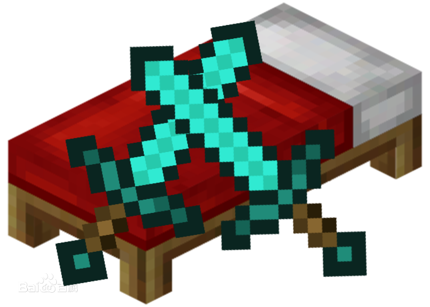

# 
BedWar     起床战争 

**简介:**
在游戏中玩家们将会以团队PVP的形式展开一场绝对不同的较量。玩家们的目的就是在游戏中来保护自己的床不被摧毁，所以要齐心协力，在游戏中依靠队友互相合作来摧毁对手的床位就算做是游戏中的胜利！

游戏特色：  
1.玩家们将会和16名玩家们一起分成四个队伍来展开互相对决，目的就是保护自己的床位；   
2.只要床铺存在，团队中的玩家就可以恢复活力，让自己的队友们能够瞬间恢复成为最佳状态重新投入战斗；   
3.建立与敌人岛屿的桥梁，入侵敌人的领地，以摧毁对手的床位为最终的目的赢得胜利 

------

游戏模式:
**- 经验模式**
**- 物品兑换模式

使用介绍:**
**一、插件启动**

1. 将本插件拖动到 plugins文件夹
2. 启动服务器直到插件加载完成

3. 进入游戏后输入，来到游戏地图，执行/bd 即可开始创建房间。

**二、指令介绍**

| 指令                | 介绍                             |
| ------------------- | -------------------------------- |
| /bd reload          | 重新读取配置文件                 |
| /bd set [名称]      | 创建一个自定义房间模板           |
| /bd tsl             | 读取模板的队伍数据与商店物品数据 |
| /bd see             | 查看加载的房间                   |
| /bd close [名称]    | 关闭房间                         |
| /bd end             | 停止模板预设                     |
| /bw                 | 进入游戏GUI                      |
| /bw join [名称]     | 加入游戏房间                     |
| /bw quit            | 离开游戏房间                     |
| /bws [你要说的内容] | 发送游戏房间内全体消息           |

**三、配置文件**

参考resources文件夹

------

**四、如何配置**

1. 执行/bd set 房间名称 开始预设模板 (请注意不要出错，不然只能执行/bd cancel重置了)

|  |  |
| ------------------------------------------------------------ | ------------------------------------------------------------ |
| 根据提示去自定义设置内容                                     | 预设完成后找到生成的team.yml文件修改团队信息并执行 **/bd tsl 重载团队数据** |
|  | 之后执行/bd set 预设好物品的生成点数量，之后执行/bd即可开始房间的配置  **注意: 在设置的时候请不要出错，不然只能/bd cancel重置标志位。队伍的商店出生点顺序为team.yml 配置文件的顺序，请根据顺序进行设置操作。** |

------

**五、更新日志:**

**2022/5/15 v1.3.3 更新**  
\+ 自动破坏床时间限制  
\+ 修复玩家退出游戏后再次进入游戏房间出现的BUG  
\+ 修改/bws 聊天为房间内全体消息 正常打字为队伍聊天  

**2022/5/20 v1.3.4 更新**
\+ 修改默认破坏床时间为120秒  
\+ 增加经验起床功能 (将商店的 money 中 铜锭 金锭这种的改为 exp 即可)  
\+ 增加经验起床的配置 在 room.yml 文件中 最下面加上 案例  
(default 为默认 exp 为经验起床)  
案例:  
roomMoney: "exp"  
\+ 增加exp 货币  
\+ 可将 item.yml 文件内的货币加上 exp 即可等值为经验  
案例:  
money:  
\# 货币名称  
\- name: "铜锭"  
\# 仅用作显示名称  
customName: "&4铜锭"  
item: "336:0"  
exp: 1  

**2022/5/20 v1.3.5 更新**  
\+ 增加随机加入房间指令 /bd rjoin  
\+ 修改创建房间的队伍提示  
\+ 增加强制终止。 /bw cancel  

**2022/5/20 v1.3.6 更新**  
\+ 将经验起床获取到的经验以等级的形式展示  

**2022/5/20 v1.3.7 更新**  
\+ 修复创建房间出现的异常BUG  
\+ 修复执行随机指令出现的BUG  
\+ 修复经验起床物品不扣除BUG  
\+ 修复创建房间文本错误的BUG  
\+ 修复经验起床商店物品价格不是经验的BUG  

**2022/5/22 v1.3.8 更新**  
\+ 增加了凋零弓物品  
示例: 在item.yml 中增加  
"凋零弓":  
customName: "&e凋零弓"  
lore: []  
item: "261:0"  

\+ 增加游戏开始时的提示内容(可自定义)  
\+ 增加游戏结束打印胜利团队数据  
\+ 优化计分板显示与其他内容的显示  

------

**六、游戏内效果:**

|  |  |
| ------------------------------------------------------------ | ------------------------------------------------------------ |
|  |  |

