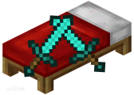
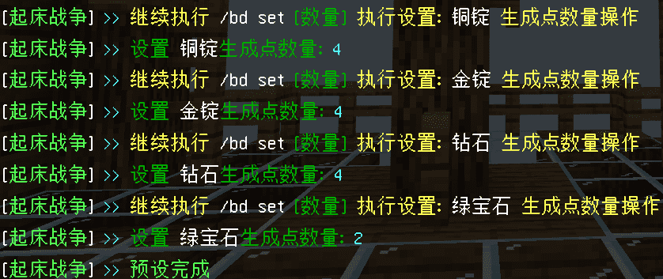
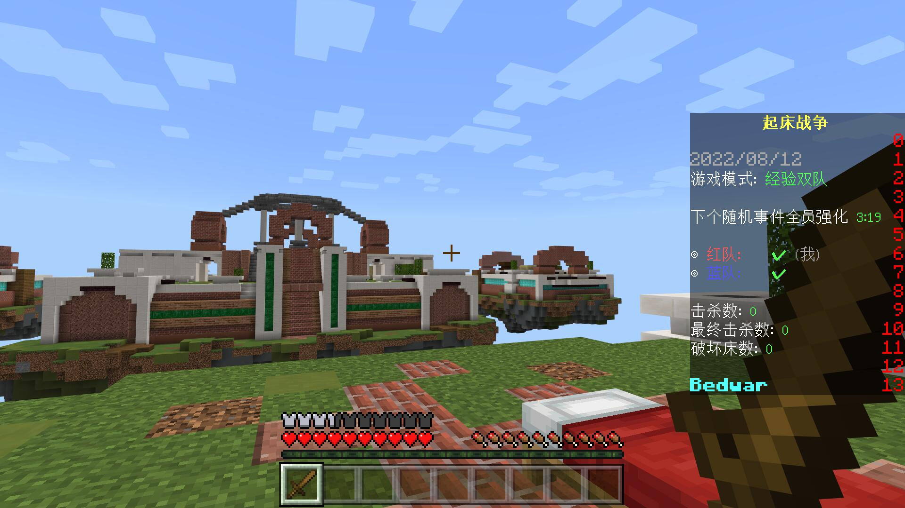
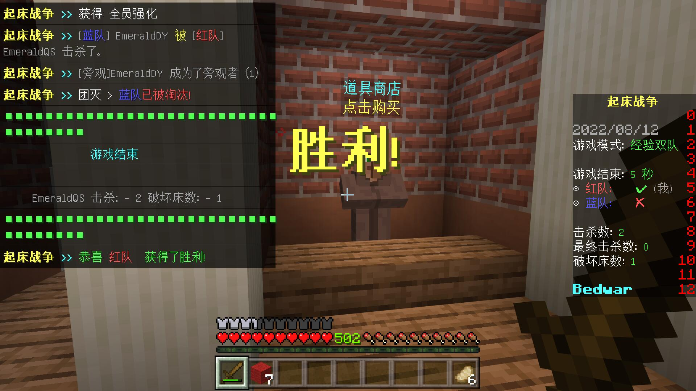
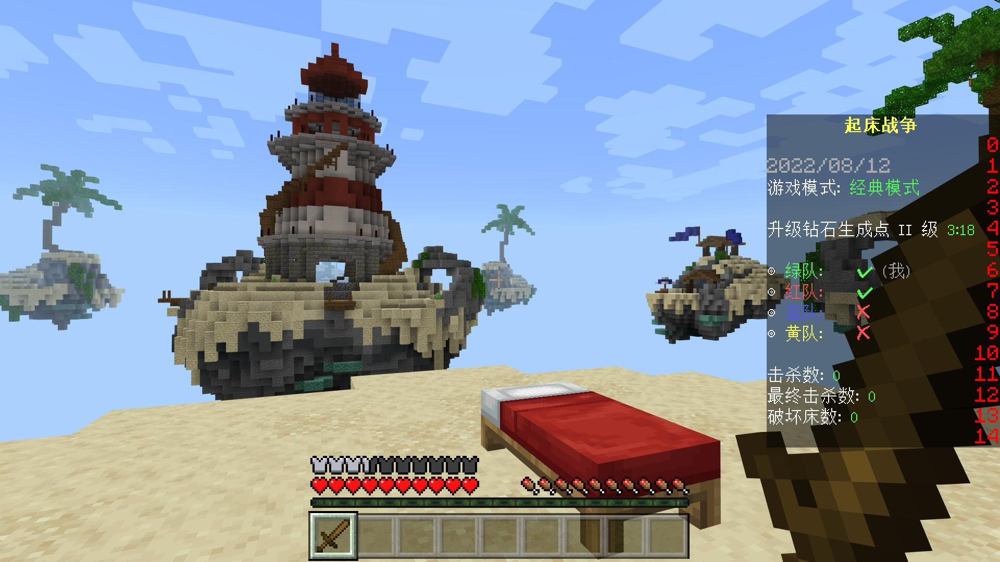
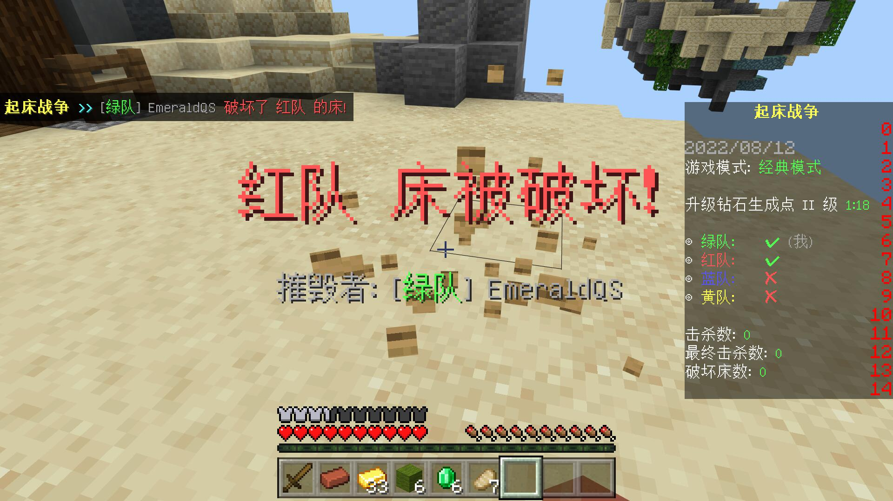
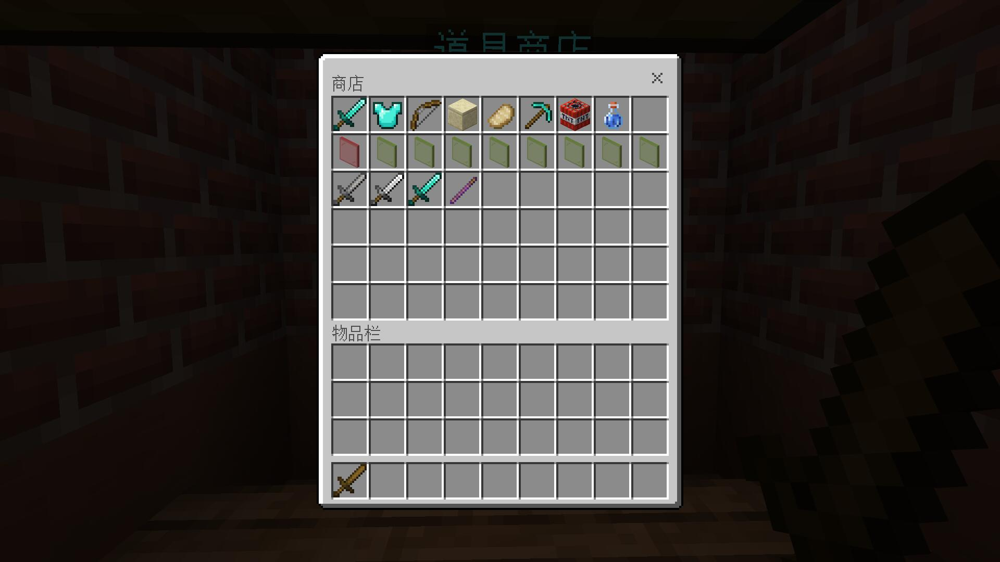

    

# 
BedWar

**Introduction:**
In the game, players will have a completely different competition in the form of team PVP. The goal of the players is to protect their beds from being destroyed in the game, so they must work together and rely on teammates to cooperate with each other to destroy the opponent's bed, which will be considered a victory in the game.！

Game Features：  
1.Players will be divided into four teams with 16 other players to compete against each other in order to protect their own beds；   
2.As long as the bed exists, players in the team can recover their vitality, allowing their teammates to instantly recover to their best condition and return to battle；   
3.Build bridges to enemy islands, invade enemy territory, and destroy opponent's beds to win the final victory.

------

GameMode:  
 1. **Exp**  
 2. **Item**  

**HOW TO USE:**  

**[DOWNLOAD](https://motci.cn/view/SoBadFish/job/BedWar/)**

**一、Enable**

1. Drag this plugin to the plugins folder
2. Start the server until the plugin is loaded

3. After entering the game, enter and come to the game map, execute /bd to start creating a room.。

**二、指令介绍**

| 指令                | 介绍                             |
| ------------------- | -------------------------------- |
| /bd reload          | reload config                 |
| /bd set [name]      | Creating a Custom Room Template           |
| /bd tsl             | Read the team data and store item data of the template |
| /bd see             | View loaded rooms                   |
| /bd close [name]    | Close room                         |
| /bd end             | Stop Template Preset                     |
| /bw                 | Join Game                      |
| /bw join [name]     | Join a game room                     |
| /bw quit            | Quit a game room                     |
| /bws [ask] | Send a message to all players in the game room           |

**三、CONFIG**

to see resources

------

**四、HOW TO CONFIG**

1. run/bd set name Start Preset Template (Please be careful not to make mistakes, otherwise you can only execute /bd cancel to reset it.)

|  |                                                                                                        |
|----------------------|----------------------------------------------------------------------------------------------------------------------------|
| Follow the prompts to customize the settings         | set team.yml file after run **/bd tsl**                                                                           |
|  |Then execute /bd set to preset the number of item generation points, and then execute /bd to start the room configuration.  **Note: Please do not make mistakes when setting, otherwise you can only reset the flag by /bd cancel. The order of the team's store spawn points is the order of the team.yml configuration file. Please set it according to the order.** |

------

**五、GAME:**

|    |    |
|----------------------|----------------------|
|    |   |
|  |  |

